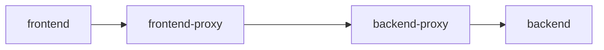
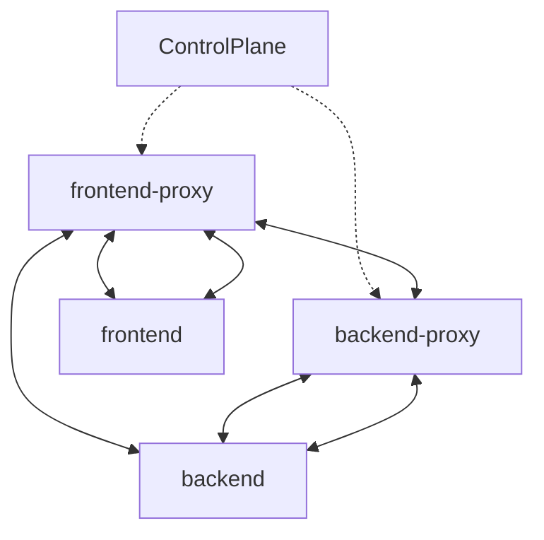

# Introdução ao Service Mesh 
## O que *service mesh*
Service mesh permite o controle da conunicação de rede, a partir de um local central (*control plane*), das cargas de trabalho. 
O service mesh é implantado e opera de forma identedente do serviços e pode ser considerado um middleware, já que afeta todos os serviços apesar de desconhecer a lógica de negócio.
Todo tráfego de entrad e saida dos serviços (microserviços, banco de dados, etc) permitindo criar regras e ou criptografar os dados no tráfego. Além de prover recursos como segurança, observabilidade, confiabilidade e controle de tráfego.

## Como funciona o Service Mesh
O service mesh composto por de sidecar proxies e control plane

### Sidecar Proxies
Tem funcionamento semelhante ao HA Proxy, Nginx Prox, etc. Ou seja todo o tráfego de entrada e saída são roteados par o destino nocaso do sidecar o proxies cada serviço terá o seu implatando localmente junto com o serviço (ou microserviço) 

### Control Plane 
Principal função do control plane é gerenciar e configurar os sidecar proxies. Nele que há a lógica do service mesh: obsevar inícioe fim de serviços, assinar e distribuir certificados, configurações de proxies, regras de tráfego, etc. 
Sidecar proxies apenas recebem configuração do plano de controle detalhando quais ações realizar no tráfego, e as executam

